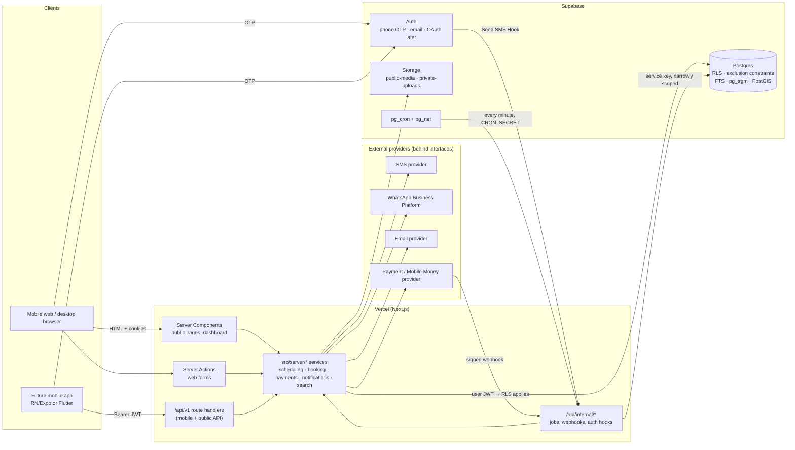

# Architecture

> Phase 0. Decisions summarised here are recorded in [`decisions/`](./decisions). Schema: [`data-model.md`](./data-model.md).
> Guiding constraint: **one developer, MVP**. Every piece of infrastructure below must justify itself.

## 1. Stack

| Layer | Choice | Why | Alternatives considered |
|---|---|---|---|
| Web framework | **Next.js (App Router) + React + TypeScript strict** | Server Components give low-JS public pages (low bandwidth); one codebase serves pages and `/api/v1`; huge ecosystem | Remix/React Router 7 (smaller ecosystem), SvelteKit (lighter bundles, but fewer hires/libraries), separate SPA + API (two deployables) |
| Styling | **Tailwind CSS** | Fast, consistent, no runtime CSS; design tokens in one config (see [`design.md`](./design.md)) | CSS Modules (more files), component kits (heavier JS) |
| Database | **Supabase Postgres** | RLS for tenant isolation, exclusion constraints for double-booking, FTS + trigram + PostGIS for search, all in one managed DB | Neon/RDS + own auth (more to build), Firebase (no relational constraints: a dealbreaker for booking) |
| Auth | **Supabase Auth** (phone OTP, email/password; OAuth-ready) | JWT works directly with RLS; phone OTP built in; custom SMS via *Send SMS Hook* | Clerk/Auth0 (extra vendor, JWT bridging to RLS), Auth.js (build OTP ourselves) |
| Storage | **Supabase Storage** | Same RLS-style policies as tables; CDN'd public bucket | S3/R2 (another account + signing code) |
| DB access | **supabase-js (PostgREST) with the user's session + SQL functions (RPC)** for transactional writes | RLS is applied automatically because we never hold a privileged connection in request paths; types via `supabase gen types` | Drizzle/Prisma over a direct connection: nicer queries, but bypasses RLS unless every query sets role/claims, which is easy to get wrong (ADR-0001) |
| Validation | **Zod** shared by forms and route handlers | One schema, both sides | Valibot (smaller; fine later), Yup |
| Phones | **libphonenumber-js** | CLAUDE.md: E.164 via a library | regex only (forbidden) |
| Dates/TZ | **date-fns + @date-fns/tz** | Small, tree-shakable, IANA zones | Luxon (heavier), Temporal polyfill (large; revisit when native in Node LTS) |
| Hosting | **Vercel** (functions pinned near the DB region) | Zero-ops Next.js, preview deploys per PR | Netlify (similar), Fly/Render + Docker (more ops), Cloudflare (Next.js adapter caveats) |
| DB region | **Supabase `eu-west` (London/Ireland)** | Accra traffic usually routes via Europe; no Supabase region in West Africa. Verify with a latency test before creating projects | `af-south-1` Cape Town if available (often *higher* latency from Accra) |
| Jobs / cron | **Supabase `pg_cron` + `pg_net`** calling protected internal routes every minute | No extra vendor; works on any Vercel plan | Vercel Cron (per-minute needs a paid plan), Inngest/Trigger.dev (another vendor), QStash |
| Tests | **Vitest**, **pgTAP** (`supabase test db`), **Playwright** | Standard, fast, runs locally and in CI | Jest (slower TS setup), Cypress |
| Errors/monitoring | Sentry (free tier), added in Phase 11 | Only once there's something to monitor | Vercel logs only |

## 2. System architecture



**Request paths**
- **Public pages** (home, search, `/business/[slug]`): Server Components, cached with short revalidation, near-zero client JS, and the booking widget as the only island.
- **Authenticated web**: `@supabase/ssr` cookie session → server code creates a Supabase client **as the user**, so RLS applies.
- **Mobile / API**: `Authorization: Bearer <supabase access token>` → same service layer, same RLS.
- **Privileged paths** (webhooks, cron, auth hooks) are the only places that use the Supabase **secret (service_role) key** (§5.4).

## 3. Roles and permissions

Roles: **Anonymous**, **Customer** (any signed-in user), **Staff** (`business_members.role = staff`, linked to a `staff` row), **Manager** (front desk; can run the business but not ownership/billing), **Owner**, **Platform admin** (`platform_admins.role`: `super_admin` | `moderator` | `support`).

Legend: **R** read · **C** create · **U** update · **D** delete/deactivate · *own* = only rows tied to them · *pub* = only published/active rows · — = none · **fn** = only via a checked SQL function

| Resource | Anon | Customer | Staff | Manager | Owner | Admin |
|---|---|---|---|---|---|---|
| Categories, locations (reference) | R | R | R | R | R | CRUD (fn, audited) |
| Business profile | R pub | R pub | R | R U | R U, publish (fn) | R; suspend/verify (fn, audited) |
| Business members / invites | — | — | R | R | CRUD (fn) | R |
| Services, prices | R pub | R pub | R | CRUD | CRUD | R |
| Staff profiles | R pub | R pub | R; U own bio/photo | CRUD | CRUD | R |
| Business hours / booking rules | R pub | R pub | R | CRU | CRU | R |
| Staff working hours | R pub | R pub | R | CRUD | CRUD | R |
| Blocked times | busy only (fn) | busy only (fn) | R; C own (fn) | CRUD (fn) | CRUD (fn) | — |
| Availability (computed) | R | R | R | R | R | R |
| Appointments | — | C (fn); R own; cancel/reschedule own within policy (fn) | R own; status arrived/completed/no-show own (fn); C walk-in for self (fn) | R; C manual/walk-in; all status changes (fn) | same as manager | R metadata; PII only via support-access fn (audited) |
| Appointment history | — | R own | R own | R | R | R |
| Business clients (CRM) | — | — | — | CRUD | CRUD | via support fn |
| Payments | — | R own; initiate for own appt (fn) | — | R; record cash (fn) | R; record cash; refund (fn) | R; dispute notes (fn) |
| Reviews | R published | C (fn: completed appt only); U own text within 14 days | R | R; respond (fn) | R; respond (fn) | hide/remove (fn, audited) |
| Review reports | — | C | C | C | C | R; resolve (fn) |
| Favorites | — | CRUD own | — | — | — | — |
| Notifications (in-app) | — | R own, mark read | R own | R own | R own | — |
| Analytics | — | — | own stats | R | R | platform-wide |
| Admin audit log | — | — | — | — | — | R (append-only) |

## 4. Multi-tenant isolation

**Model:** shared database, shared schema, `business_id` on every tenant-owned row, and Postgres RLS on every table. No schema-per-tenant (ADR-0002).

1. **Membership is the single source of truth.** `business_members(business_id, user_id, role)`. RLS policies call `private.*` helpers:
   - `is_business_member(bid)`, `can_manage_business(bid)` (owner/manager), `has_business_role(bid, roles[])`, `is_published_business(bid)`, `is_platform_admin()`.
   - They are `SECURITY DEFINER`, `STABLE`, with `search_path = ''`, and live in the `private` schema, which PostgREST does not expose.
   - Policies wrap them as `(select private.fn(...))` so Postgres evaluates them once per statement, not per row (Supabase RLS performance guidance).
2. **Cross-tenant consistency by construction.** Child tables use composite FKs `(business_id, staff_id) → staff(business_id, id)`. A row can't reference another tenant's staff/service/client, even through a bug.
3. **Writes that span tables or need invariants** (create business + owner membership, booking, status changes, blocks, reviews, invites) go through `SECURITY DEFINER` functions. Each one checks `auth.uid()` membership explicitly, and there are **no direct INSERT/UPDATE policies** on those tables. Column-level `GRANT UPDATE (...)` limits what direct updates can touch (e.g. an owner can edit `businesses.name` but not `status`).
4. **Customers** see their own rows via `customer_user_id = auth.uid()`. Businesses see customer details through **snapshots on the appointment** and their own `business_clients` rows, never through `profiles`.
5. **Public data** (published businesses, active services/staff, hours) has explicit `for select` policies. Busy times reach the public only through `get_busy_intervals()`, which returns `(staff_id, range, kind)` and no customer data.
6. **Platform admin** has **no RLS bypass**. Admins get read policies on moderation tables and act through `admin_*` definer functions. Each function writes an `admin_actions` row (who, what, target, reason, before/after) in the same transaction, so the action fails if the audit fails. Viewing a customer's PII goes through `admin_support_view_*`, which also logs.
7. **Containing the secret (`service_role`) key**
   - Only in `src/server/privileged/supabase-admin.ts`, which starts with `import 'server-only'`. An ESLint `no-restricted-imports` rule allows importing it only from `src/app/api/internal/**` and `src/server/jobs/**`.
   - Never in `NEXT_PUBLIC_*`. CI greps the client build output for the key prefix.
   - Used only for: payment webhooks, the notification dispatcher, the Send SMS auth hook, and seeding. Each of those endpoints authenticates the caller (HMAC signature / `CRON_SECRET` / hook secret) before touching the DB.
8. **Proof, not promises.** Every tenant table ships with pgTAP tests. Two businesses and five personas (anon, customer, staff A, owner A, owner B) assert that B can't read or write A's rows for each operation (see `dev-setup.md` §Testing).

## 5. Authentication

| Flow | Mechanism |
|---|---|
| Phone OTP (primary) | Supabase Auth `signInWithOtp({ phone })`. SMS delivery goes through the **Send SMS Hook** to `/api/internal/auth/send-sms`, which calls our `SmsProvider` (Ghana-local or international vendor, chosen in Phase 1/8). This avoids depending on Supabase's built-in vendor list. Local dev uses Supabase `auth.sms.test_otp` fixed codes and `MockSmsProvider` |
| Email + password | Supabase email auth, optional for providers who want it. Email confirmation on; passwords hashed by Supabase (bcrypt). We never see plaintext |
| Google / Apple (later) | Supabase OAuth providers; `profiles` keyed on `auth.users.id`, so linking identities adds no schema change. Apple is required on iOS if we offer other social logins in a native app |
| "Guest" booking | **Assumption:** guests verify their phone with OTP but skip creating a profile/password. OTP creates a lightweight auth user (see open question in the Phase 0 summary). This keeps the booking RPC `authenticated`-only and cuts spam/no-shows |
| Sessions (web) | `@supabase/ssr` httpOnly, `Secure`, `SameSite=Lax` cookies; refreshed in `src/proxy.ts` (Next 16's renamed middleware) |
| Sessions (mobile) | Supabase SDK stores access and refresh tokens in secure storage; API gets `Bearer` access token (1h expiry, refresh rotation) |
| Profile bootstrap | `on auth.users insert` trigger creates the `profiles` row |
| OTP abuse | Supabase OTP rate limits (per phone and per IP) plus our hook refusing more than N SMS per phone per hour (table-backed counter). Short OTP expiry; Cloudflare Turnstile on the phone form if abuse appears |
| Account deletion | `delete_my_account()` anonymises profile, nulls `customer_user_id` on appointments (snapshots become "Deleted customer"), deletes favorites/consents, then deletes the auth user via the admin API (server-only) |

## 6. Scheduling and availability

### Inputs
Business `timezone`; `business_hours` (per ISO weekday, several ranges allowed = breaks); `staff.uses_business_hours` / `staff_working_hours`; `blocked_times` (per staff or whole business: days off, holidays, one-off breaks); existing live appointments (`pending` with unexpired hold, `confirmed`, `arrived`, `completed`) with their `occupied` range including buffers; service `duration_minutes`; eligible staff (`staff_services`, active, accepts online); `booking_rules` (`slot_interval_minutes`, `min_notice_minutes`, `max_advance_days`, `buffer_before/after_minutes`).

### Rules
- A slot at `t` for staff `s` is **bookable** iff:
  1. `[t, t+duration)` lies inside one of the staff member's working ranges for that local date. Working range = business hours, intersected with staff hours when the staff member has their own.
  2. `[t, t+duration)` doesn't overlap any blocked time for `s` or the business.
  3. `[t−before, t+duration+after)` doesn't overlap any live appointment's `occupied` range for `s`.
  4. `now + min_notice ≤ t ≤ now + max_advance`.
- **Granularity:** candidate starts sit on a grid of `slot_interval_minutes` (default 15), anchored at the start of each working range, so a shop opening at 08:10 offers 08:10, 08:25, … Durations are multiples of 5 minutes.
- **Timezone:** all arithmetic is done on local wall-clock per date in the business's IANA zone, then converted to UTC instants. Ghana has no DST, but zones that do are handled naturally: a local time that doesn't exist is skipped, and a repeated one takes the first instance. Storage is always `timestamptz`.
- **Overnight ranges** (e.g. 22:00–02:00) are out of scope for MVP (validated at input).

### Pseudocode (`src/server/scheduling/availability.ts`, pure function)
```ts
function availableSlots(input: {
  tz: string; rules: BookingRules; service: { durationMin: number };
  staff: StaffSchedule[];           // eligible staff with weekly ranges (already intersected with business hours)
  busy: Map<StaffId, Interval[]>;   // from get_busy_intervals(): occupied ranges + blocks
  blocks: Map<StaffId, Interval[]>;
  dateLocal: LocalDate; now: Instant;
}): Slot[] {                        // Slot = { start: Instant; staffIds: StaffId[] }
  const earliest = now + rules.minNotice, latest = now + rules.maxAdvance;
  const byStart = new Map<Instant, StaffId[]>();

  for (const s of input.staff) {
    for (const range of s.rangesFor(isoWeekday(dateLocal))) {             // local wall-clock ranges
      const open = toInstantInterval(dateLocal, range, tz);               // DST-safe conversion
      for (let t = open.start; t + dur <= open.end; t += rules.interval) {
        if (t < earliest || t > latest) continue;
        const service  = [t, t + dur);
        const occupied = [t - rules.bufferBefore, t + dur + rules.bufferAfter);
        if (overlapsAny(service, blocks.get(s.id))) continue;
        if (overlapsAny(occupied, busy.get(s.id))) continue;
        push(byStart, t, s.id);
      }
    }
  }
  return sortByStart(byStart);   // UI shows the time; "any available" = staffIds.length > 0
}
```
`blocks` and `busy` both come from one RPC call per request (`get_busy_intervals(business, dayStart, dayEnd)`). Complexity is O(staff × slots × busy), trivial at our scale. Pre-sort intervals and sweep if it ever matters.

### "Any available professional"
1. Slot list = union across eligible staff (as above).
2. At booking, the server orders the candidates for that start time: **fewest booked minutes that day first**, then `staff.sort_order`. This spreads load and is deterministic in tests.
3. `book_appointment(..., p_staff_ids => ordered[])` tries each candidate in order inside the DB. The exclusion constraint decides, and a conflict falls through to the next candidate. Only if **all** fail does the client get `409 SLOT_UNAVAILABLE` with fresh slots.

### Server-side re-validation
The TS function **lists** slots; the SQL function **accepts** bookings. `book_appointment` re-checks the window, working hours (`private.within_working_hours`), blocks, and overlap (constraint). The client never has to be trusted. A **parity test** runs randomised fixtures and asserts that every slot TS offers is accepted by SQL. That catches drift between the two implementations.

### Next-available cache
`businesses.next_available_at` powers result cards. It is recomputed by the dispatcher job when a booking, block or hours change for that business (debounced), and every 30 minutes otherwise. Cards say "Next: Today 3:15 PM". It is *advisory*: the booking page always computes live.

## 7. Double-booking prevention (summary of ADR-0003)

**Mechanism:** a GiST **exclusion constraint** on `appointments`:
```sql
exclude using gist (staff_id with =, occupied with &&)
  where (status in ('pending','confirmed','arrived','completed'))
```
- `occupied` = `[starts_at − buffer_before, ends_at + buffer_after)`, set by trigger (`timestamptz ± interval` isn't immutable, so it can't be a generated column).
- `btree_gist` makes `uuid =` usable in the GiST index.
- **Blocked times vs. appointments** live in different tables, so the constraint can't cover them. `book_appointment` and `create_blocked_time` both take `pg_advisory_xact_lock(hash('staff:'||id))` and check each other's table under that lock. Direct inserts into `blocked_times` are not granted.
- **Pending holds** (deposit required) block the slot for `pending_hold_minutes`. Expired holds are cancelled by the job and also lazily inside `book_appointment` for that staff member.

| Option | Guarantees under concurrency | Cost | Verdict |
|---|---|---|---|
| **Exclusion constraint (tstzrange + btree_gist)** | Yes, enforced by the DB for every writer, including admin SQL and bugs | One index; must retry/fall through on `23P01` | **Chosen** |
| `SELECT … FOR UPDATE` on staff row, then check-then-insert | Yes, if *every* writer follows the protocol | Easy to forget in a new code path; no protection for raw SQL | Rejected as primary |
| Advisory locks + check | Same caveat as row locks | Invisible, convention-based | Used only for block↔appointment |
| `SERIALIZABLE` isolation | Yes, but with retry storms under contention | Every write path must retry | Rejected |
| Unique `(staff_id, slot_start)` on a slot table | Only for fixed-length grid slots | Breaks with variable durations/buffers | Rejected |

**Tested by:** pgTAP (overlap rejected; touching ranges `[10:00,10:30)` + `[10:30,11:00)` allowed; cancelled/no-show don't block; buffers honoured; blocks reject) and a **concurrency test** (N parallel connections booking the same slot). Phase 0 smoke run on the draft: 10 parallel sessions, 2 eligible staff → exactly **2 successes, 8 `BK409`**.

## 8. Payments

```ts
// src/server/payments/provider.ts
interface PaymentProvider {
  readonly id: string;                              // 'mock' | 'cash' | '<vendor>'
  readonly methods: PaymentMethod[];                // ['mobile_money','card']
  createCharge(input: {
    paymentId: string; idempotencyKey: string;
    amountMinor: number; currency: string;
    customer: { phoneE164?: string; email?: string; name: string };
    method: PaymentMethod; returnUrl: string; description: string;
  }): Promise<{ providerReference: string; next: { type: 'redirect'; url: string }
                                              | { type: 'await_customer_approval'; message: string } // e.g. MoMo prompt on phone
                                              | { type: 'none' } }>;
  verifyWebhook(req: { headers: Headers; rawBody: string }): Promise<ProviderEvent | null>; // null = bad signature
  fetchStatus(providerReference: string): Promise<ProviderStatus>;    // reconciliation
  refund(input: { providerReference: string; amountMinor: number; idempotencyKey: string }): Promise<RefundResult>;
}
```

- **Providers:** `MockPaymentProvider` (dev/staging; a `/dev/mock-pay/[id]` page simulates approve/decline/timeout and posts a signed fake webhook). `CashProvider` (manual "mark paid" by staff). A real Mobile Money/card aggregator is picked in Phase 9, **from its published docs, never guessed**. `PAYMENTS_PROVIDER` selects the provider; startup throws if `mock` is configured when `APP_ENV=production`.
- **Status machine** (`payments.status`):
  ```
  pending ──paid──▶ paid ──refund──▶ refunded
     │                 └─partial refund─▶ partially_paid (net amount < original)
     ├──partial capture──▶ partially_paid ──rest──▶ paid
     └──fail/timeout──▶ failed           (terminal; a retry creates a new payment row)
  ```
  `appointments.payment_status` is derived from the sum of its payments: `null` (nothing due online) / `pending` / `partially_paid` (deposit paid, balance due) / `paid` / `refunded` / `failed`.
- **Idempotency:** `payments.idempotency_key` (unique) = `appt:{id}:{kind}:{attempt}`, sent to the provider when it supports keys. Webhooks are stored first in `payment_events` with `unique(provider, provider_event_id)`: a duplicate delivery hits the conflict and returns `200` without reprocessing. Processing runs in one transaction: `select … for update` on the payment, apply the transition only if valid from the current state, then set `processed_at`.
- **Reconciliation:** the job polls `fetchStatus` for payments `pending` > 10 min, because webhooks get lost.
- **Deposit flow:** booking → appointment `pending` + hold → charge → webhook `paid` → appointment `confirmed` + notifications. Hold expiry → `failed`/`cancelled`, and the slot is released.
- **Money never flows through the platform in MVP.** Providers are paid into their own merchant accounts (no escrow/payouts). This avoids licensing questions.

## 9. Notifications

```ts
interface NotificationChannelProvider {
  readonly channel: 'sms' | 'whatsapp' | 'email';
  readonly id: string;                          // 'mock-sms', '<vendor>'
  send(msg: { to: string; templateKey: string; locale: string; params: Record<string,string>; body: string })
    : Promise<{ providerMessageId: string } | { retryable: boolean; error: string }>;
}
```

- **Outbox pattern:** business events (`booking.confirmed`, `booking.cancelled`, …) insert rows into `notifications` in the same transaction as the change: one row per recipient × channel, with `dedupe_key` unique. Nothing is sent inline in the request.
- **Dispatcher:** `pg_cron` → `POST /api/internal/jobs/dispatch` every minute. The route claims due rows with `update … set status='sending' … where id in (select … for update skip locked limit 50)`, renders, sends, and marks `sent` or `failed`. Retries use exponential backoff (1, 5, 30 min, max 4 attempts) for retryable errors.
- **Channel choice per recipient:** in-app always. Then WhatsApp if enabled and the user opted in, else SMS. Email if an address exists and `notify_email`. Providers' new-booking alerts are SMS + in-app by default.
- **Templates:** code-side, typed (`templates/booking-confirmed.ts` → `{ sms, whatsapp, email, inApp }`), i18n-ready. WhatsApp business-initiated messages need **pre-approved templates** on the WhatsApp Business Platform, so template keys map 1:1 to approved names. SMS ≤ 160 GSM-7 chars where possible (cost).
- **Reminders:** when an appointment becomes `confirmed`, insert `scheduled_for = starts_at − 24h` and `− 2h` rows (skipped if already in the past), with dedupe keys `reminder24h:{appt}:{channel}`. On cancel/reschedule, the same transaction marks pending reminder rows `cancelled` and inserts new ones.
- **Mocks:** `MockSmsProvider`, `MockWhatsAppProvider`, `MockEmailProvider` write to the log and to a dev-only `/dev/outbox` page. They are selected by `SMS_PROVIDER=mock` etc. and refused in production.

## 10. Search

**Phase 4 approach: Postgres only.**
- `businesses.search_vector` (weighted: name A, categories + keywords B, area/city C, description D), built with `unaccent` + the `simple` config. Names are multilingual, so English stemming would hurt more than it helps. It's maintained by triggers on businesses, categories, locations and services.
- `pg_trgm` GIN on `businesses.name` and `areas.name` for typos ("barbar", "Eastlegon").
- **Query parsing** (`src/server/search/parse.ts`):
  - Split on ` in ` / ` near `. Resolve the location part against `areas`/`cities` (trigram match), and treat "near me" as a geolocation request.
  - Match the remainder against `categories.search_keywords`, e.g. "Braids" → Braids & locs, "Massage" → Spa & massage, "Home cleaning" → Cleaning. Whatever is left becomes an FTS query.
- **Ranking:** `ts_rank` + trigram similarity + rating (Bayesian) + small boosts for "has availability today" and profile completeness. Distance is used as the sort when location is known (`ST_DWithin` + `<->` on the GiST index).
- **Location:** PostGIS `geography(Point)` on `business_locations`. Fallback when coordinates are missing: area/city match. Browser geolocation only after the user taps "Near me".
- **When we'd outgrow it:** p95 search > 300 ms at realistic load, a need for facet counts across many filters, heavy typo-tolerance or synonyms per language, or > ~200k listings. Next step is **Typesense or Meilisearch** fed from an outbox. Not before (ADR-0007).

### As built (Phase 4)
- `businesses.search_document` is rebuilt by triggers whenever the name, description, categories (and their keywords), active services or location change (`private.refresh_business_search`).
- `match_search_terms(what, where, country)` resolves the words to a category (name or keyword, typo-tolerant via trigram, singular/plural) and the place to an area → city → region.
- `search_businesses(...)` is `SECURITY DEFINER` with explicit *published and not deleted* filters. It returns only public card fields, so it avoids per-row RLS calls in a hot query.
- `src/server/search/marketplace.ts` parses "what in where" / "near me", runs the search, and **widens with a notice** when a place has no matches instead of showing an empty page.
- Measured with 5,000 generated businesses (`scripts/perf/search_perf.sql`): p50 ≈ 10 ms, p95 ≈ 40 ms (target < 300 ms).

## 11. Files and images

| Bucket | Access | Contents | Path convention |
|---|---|---|---|
| `public-media` | Public read (CDN). Write/delete only by business owner/manager (storage policy checks `businesses/{business_id}/…`), or self for `users/{uid}/avatar` | Logos, covers, portfolio, staff photos, avatars | `businesses/{bid}/{logo|cover|photos|staff}/{uuid}-{w}.webp` |
| `private-uploads` | No public read; signed URLs (short TTL) for owners; admins via audited fn | Verification documents (later) | `businesses/{bid}/verification/{uuid}` |

- **Low bandwidth:** resize and convert **in the browser before upload** (canvas → WebP), into two widths: 400 px (cards/thumbs) and 1200 px (gallery). EXIF (GPS!) is stripped as a side effect. Uploads are limited to 5 MB input and ≤ 300 KB per output. Cards load 400 px with `loading="lazy"` and explicit `width/height` (no layout shift).
- **Alternatives:** Supabase Image Transformations (paid plan, simpler) or Vercel image optimisation (costs per image). Revisit if client-side resizing proves flaky on low-end Android.
- Deleting a photo row deletes its objects in the same server action. A weekly job removes orphans.

## 12. API boundaries (future mobile apps)

- **Everything a mobile app needs is under `/api/v1`**, documented in `docs/api/` (OpenAPI generated from Zod schemas with `zod-to-openapi` when the first endpoint lands, in Phase 4/5).
- **Auth:** Supabase access token in `Authorization: Bearer`. The same handler also accepts the web cookie session. There are no API keys for end users.
- **Shape:** resource-oriented JSON. `snake_case` keys (match DB, mobile-neutral). Money as `{ amount_minor, currency }`. Times as ISO-8601 UTC plus the business `timezone`. Cursor pagination (`?cursor=&limit=`). Errors look like `{ error: { code: 'SLOT_UNAVAILABLE', message, details? } }` with the right HTTP status (400/401/403/404/409/422/429).
- **Idempotency:** `POST /api/v1/appointments` and payment endpoints accept an `Idempotency-Key` header (stored 24h).
- **Versioning:** URL major version. Additive changes are free. Breaking changes mean `/api/v2`, running side by side for ≥ 6 months, with the minimum app version enforced via a `/api/v1/meta` endpoint.
- **Sketch:** `GET /categories`, `GET /search`, `GET /businesses/{slug}`, `GET /businesses/{id}/availability?service_id&staff_id|any&date`, `POST /appointments`, `POST /appointments/{id}/cancel|reschedule`, `GET /me/appointments`, `PUT/DELETE /me/favorites/{business_id}`, `POST /appointments/{id}/review`, provider endpoints under `/provider/businesses/{id}/…`.
- Web UI uses **Server Actions** for forms. They call the same `src/server` services, so behaviour is identical and the logic isn't duplicated.

## 13. Security

| Concern | Control |
|---|---|
| Authorization | RLS on every table, definer functions for invariants, server-side checks in services; UI hiding is cosmetic only |
| Input validation | Zod at every boundary; DB `check` constraints as the last line |
| Injection | PostgREST/RPC parameterisation; no string-built SQL; `search_path = ''` in definer functions |
| XSS | React escaping; no `dangerouslySetInnerHTML` for user content; strict CSP (nonce-based) set in `src/proxy.ts` |
| CSRF | Server Actions have built-in origin checks; route handlers that use cookies check `Origin`; the Bearer API is not cookie-authenticated |
| Rate limiting | OTP: Supabase limits + hook counter. Booking: in-DB per-user limit (can't be bypassed via PostgREST). Search/API: per-IP limiter in `src/proxy.ts` (Postgres-backed; Upstash only if it becomes hot) |
| Secrets | Vercel encrypted env vars, per environment; secret key server-only (§4.7); webhooks verified by HMAC; secret scanning on the repo |
| Sessions | httpOnly + Secure cookies, short-lived JWT, refresh rotation, sign-out-everywhere |
| Audit | `admin_actions` (append-only), `appointment_status_history`, `payment_events` |
| Least privilege | Staff limited to their own appointments; managers can't change ownership; admins act via functions |
| Dependencies | Minimal deps; `pnpm audit` and Dependabot in CI |

## 14. Privacy (Ghana Data Protection Act, 2012 (Act 843))

*Engineering-level measures only. This is not legal advice; confirm the obligations with a Ghanaian data-protection practitioner before launch.*

- **Registration:** Act 843 expects data controllers to register with the **Data Protection Commission**. This is a pre-launch task (roadmap Phase 11).
- **Data minimisation:** we collect name + phone to book. Email, photo and location are optional. Precise location is never stored for customers, only used transiently for "near me".
- **Purpose & consent:** transactional messages are needed to deliver the service. Marketing messages require opt-in consent recorded in `consents` (kind, version, timestamp, source).
- **Data subject rights:** access (profile + appointments view; admin-run export until self-service exists), correction (profile edit), deletion (`delete_my_account()` anonymises booking records that businesses legitimately keep).
- **Business deactivation:** status `deactivated` hides the business at once. Their clients' data is retained for a defined period (proposed 12 months), then purged by a job.
- **Security safeguards:** encryption in transit (TLS) and at rest (Supabase), RLS, audited admin access to PII, backups (Supabase PITR on production when affordable, daily backups minimum).
- **Cross-border transfer:** data hosted in the EU (§1). Document this in the privacy notice and confirm it's acceptable under Act 843 and the DPC's guidance.
- **Retention:** notifications 90 days; payment events 7 years (financial records); status history kept with appointments.
- **Children:** the terms require 18+ for accounts (or guardian consent). No special-category data is collected. Medical & wellness providers must not put health details in notes (UI warning).
