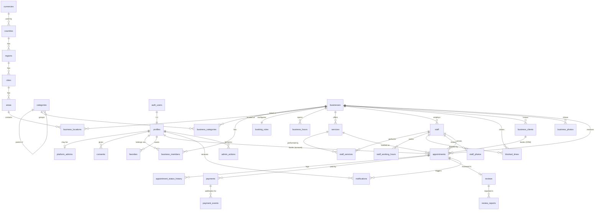

# Data Model

> SQL: real migrations live in [`supabase/migrations/`](../supabase/migrations). Tables not yet migrated are still in the Phase 0 draft [`supabase/drafts/0000_initial_schema.draft.sql`](../supabase/drafts/0000_initial_schema.draft.sql), and each phase moves its tables from the draft into migrations.
> Conventions: money = `*_minor int` + `currency_code char(3)` · time = `timestamptz` UTC, wall-clock only in `*_hours` · weekday = ISO (1 = Mon) · every tenant table has `business_id` + RLS.

## Migration status

| Phase | Migrated tables                                                                                                                                                                                                                                                                                                                                                                                                                                                                                                                                                                                                                                                                                                     |
| ----- | ------------------------------------------------------------------------------------------------------------------------------------------------------------------------------------------------------------------------------------------------------------------------------------------------------------------------------------------------------------------------------------------------------------------------------------------------------------------------------------------------------------------------------------------------------------------------------------------------------------------------------------------------------------------------------------------------------------------- |
| 1     | currencies, countries, regions, cities, areas, categories, profiles, platform_admins, consents, businesses, business_members                                                                                                                                                                                                                                                                                                                                                                                                                                                                                                                                                                                        |
| 2     | business_categories, business_locations (+ `locality_text` for unlisted towns, plain `lat`/`lng` with a generated `geo`), booking_rules, staff (basic), business_photos (`path_small`/`path_large`); storage buckets + policies                                                                                                                                                                                                                                                                                                                                                                                                                                                                                     |
| 3     | services, staff_services, business_hours, staff_working_hours (`timerange` + GiST no-overlap), blocked_times, **staff_invites** (new: hashed one-time token, phone-bound), admin_actions                                                                                                                                                                                                                                                                                                                                                                                                                                                                                                                            |
| 5     | business_clients, appointments (exclusion constraint, idempotency key), appointment_status_history. Not yet: `hold_expires_at` / pending holds (arrive with deposits in Phase 9)                                                                                                                                                                                                                                                                                                                                                                                                                                                                                                                                    |
| 6     | `appointments.final_price_minor`; `business_client_summaries` view (security_invoker); staff can read their own appointments' history                                                                                                                                                                                                                                                                                                                                                                                                                                                                                                                                                                               |
| 7     | **favorites** (PK user+business; private to the user), **reviews** (one per completed appointment; snapshots author "Kofi A.", service, staff, visit date; `status` published/hidden/removed; one business reply; `businesses.rating_avg/count` kept by trigger over published reviews), **review_reports** (one per person per review), `business_photos.service_id` (composite FK keeps it in-business). Functions: `submit_review`, `update_review` (14 days), `reply_to_review` (owners/managers), `report_review`, `admin_moderate_review` (audited), `account_deletion_blocker`, `delete_my_account`, `my_favorite_businesses`                                                                                |
| 7+    | `businesses` social links (`instagram_handle`, `tiktok_handle`, `x_handle`, `facebook_url`, `youtube_url`, `website_url`; format checks, owner/manager column grants); `price_type` gains **`on_request`** (amount 0, no deposit, ignored as a starting price; the final price is entered at completion). More seed categories: trades (electricians, plumbers, AC/phone repair, mechanics, tailors, carpentry, laundry, driving lessons), events (DJs & MCs, catering, musicians & bands) and creators (influencers & creators, videography, graphic design, copywriting)                                                                                                                                          |
| 8     | **notifications** (outbox + in-app inbox; `claimed_at` for stuck-send recovery; RLS: own due in-app messages, admins read all; only `read_at` updatable), `businesses.notify_new_booking_sms`. Trigger `appointments_notify` writes events and reminders; `claim_notifications` / `finish_notification` for the dispatcher (service role only)                                                                                                                                                                                                                                                                                                                                                                      |
| +     | **Verified businesses** (ADR-0015): `businesses.verification_status` (none · pending · verified · declined), `verification_requested_at`, `verified_at` (read-only to owners: no column grants); **business_verification_notes** (admin's note to the owner; RLS: owner and admins read, nobody writes directly). `request_business_verification` (owner), `admin_set_business_verification` (admin, reason required, audited in `admin_actions`); a rename resets the check                                                                                                                                                                                                                                        |
| 9     | Online payments (built, then removed in the same phase by ADR-0017). Final shape: `booking_rules.accepted_payment_methods` (payment_method[]: cash, mobile_money, bank_transfer, card; public), `appointments.payment_method_choice`, **business_payment_details** (owner writes via `set_payment_details`; owners/managers/admins read; customers only via `get_booking_payment_details` for their own booking), **payments** as a record of money the business marked received (`record_payment`, capped at a fixed price) or refunded (`mark_payment_refunded`); RLS: the customer, owners/managers, admins read; nobody writes directly. `services.deposit_minor` and `appointments.deposit_minor` were dropped |
| later | the rest, still in the draft                                                                                                                                                                                                                                                                                                                                                                                                                                                                                                                                                                                                                                                                                        |

## 1. ER diagram



## 2. Changes vs. SPEC §19 starting list

| SPEC table                                                      | Decision                                                           | Reason                                                                                         |
| --------------------------------------------------------------- | ------------------------------------------------------------------ | ---------------------------------------------------------------------------------------------- |
| `users`                                                         | = Supabase `auth.users`                                            | Managed by Supabase Auth                                                                       |
| `customer_profiles`                                             | Merged into **`profiles`**                                         | Every user can be a customer; one table avoids a pointless 1:1                                 |
| `staff_availability`                                            | Renamed **`staff_working_hours`** + `blocked_times` for exceptions | Clear split: recurring vs. one-off                                                             |
| `admin_actions`                                                 | Kept, append-only                                                  | Audit                                                                                          |
| _(new)_ `business_clients`                                      | Added                                                              | Businesses need a client list that includes walk-ins without accounts; keeps PII tenant-scoped |
| _(new)_ `platform_admins`                                       | Added                                                              | Admin role as data, not a JWT flag that could go stale                                         |
| _(new)_ `consents`                                              | Added                                                              | Act 843 consent records                                                                        |
| _(new)_ `currencies`, `countries`, `regions`, `cities`, `areas` | Added                                                              | "Locations and currencies are data" (CLAUDE.md)                                                |
| _(new)_ `payment_events`                                        | Added                                                              | Webhook idempotency and audit                                                                  |
| _(new)_ `review_reports`                                        | Added                                                              | SPEC §15 "reporting"                                                                           |

## 3. Table notes

### Reference data (public read, admin write)

| Table                          | Key points                                                                                                                                                                                          |
| ------------------------------ | --------------------------------------------------------------------------------------------------------------------------------------------------------------------------------------------------- |
| `currencies`                   | ISO 4217 code PK, `minor_unit` (GHS = 2). Formatting uses `Intl.NumberFormat`, and the `symbol` column is only a display override (`GH₵`)                                                           |
| `countries`                    | ISO alpha-2 PK, `currency_code`, `calling_code` ('233'), `default_timezone`, `is_active` (only GH at launch)                                                                                        |
| `regions` → `cities` → `areas` | Slugs unique per parent. `centroid geography(Point)` for "near me" fallback and map centring. Seeds: Greater Accra/Accra/East Legon, Osu…; Ashanti/Kumasi/Adum…; Tema, Takoradi, Cape Coast, Tamale |
| `categories`                   | Self-referencing `parent_id` (optional sub-categories), `search_keywords text[]` for query matching, `sort_order`, `is_active`                                                                      |

### Identity

| Table             | Key points                                                                                                                               |
| ----------------- | ---------------------------------------------------------------------------------------------------------------------------------------- |
| `profiles`        | PK = `auth.users.id`. `phone_e164` unique. Notification preferences. `deleted_at` + anonymisation on deletion. **Only readable by self** |
| `platform_admins` | `role`: super_admin / moderator / support. Presence = admin                                                                              |
| `consents`        | Append-only history; latest row per `(user, kind)` wins                                                                                  |

### Tenant root and config

| Table                 | Key points                                                                                                                                                                                                                                                                                             |
| --------------------- | ------------------------------------------------------------------------------------------------------------------------------------------------------------------------------------------------------------------------------------------------------------------------------------------------------ |
| `businesses`          | Tenant root. `slug` unique (public URL). `kind` solo/team drives onboarding. `status` draft → published ↔ suspended; deactivated. `timezone` IANA. Read-model columns (`rating_*`, `next_available_at`, `search_vector`) are maintained by triggers/jobs and never used for authorization. Soft delete |
| `business_members`    | PK `(business_id, user_id)`, `role` owner/manager/staff. The authorization source of truth                                                                                                                                                                                                             |
| `business_categories` | M:N, at most one `is_primary` (partial unique index)                                                                                                                                                                                                                                                   |
| `business_locations`  | Area/city FKs + `address_line`, **`landmark`**, `directions`, optional `geo`. One primary per business (MVP UI supports one)                                                                                                                                                                           |
| `booking_rules`       | 1:1. Slot interval, notice, advance window, buffers, cancel/reschedule windows, auto-confirm, guest booking, hold duration. All with check constraints                                                                                                                                                 |
| `business_hours`      | Several `timerange` rows per weekday (split shifts = breaks). A GiST exclusion stops overlapping rows. `'24:00'` allowed                                                                                                                                                                               |

### Catalogue and team

| Table                 | Key points                                                                                                                                                                                                      |
| --------------------- | --------------------------------------------------------------------------------------------------------------------------------------------------------------------------------------------------------------- |
| `services`            | `price_minor`, `price_type` fixed/"from", `currency_code`, `duration_minutes` (5-min multiples), optional `deposit_minor ≤ price`. `unique(business_id, id)` for composite FKs. Soft delete                     |
| `staff`               | `user_id` nullable (staff without login). `uses_business_hours` (solo default), `accepts_online_bookings`. A solo business gets exactly one staff row for the owner, created by onboarding and hidden in the UI |
| `staff_services`      | Composite FKs guarantee staff and service belong to the same business                                                                                                                                           |
| `staff_working_hours` | Same shape as business hours; used only when `uses_business_hours = false`. Availability = intersection with business hours                                                                                     |
| `blocked_times`       | `tstzrange`. `staff_id` null = whole business (holiday). Written only via `create_blocked_time()`                                                                                                               |

### Bookings

| Table                        | Key points                                                                                                                                                                                                                                                                                                                                                                                                                                                                                                  |
| ---------------------------- | ----------------------------------------------------------------------------------------------------------------------------------------------------------------------------------------------------------------------------------------------------------------------------------------------------------------------------------------------------------------------------------------------------------------------------------------------------------------------------------------------------------- |
| `business_clients`           | Per-business CRM record: name, phone, notes, optional `user_id`. Unique per business by user and by phone. Only managers/owners read it                                                                                                                                                                                                                                                                                                                                                                     |
| `appointments`               | One service × one staff × one time range. Snapshots of service name, price, currency, deposit, customer name/phone, so history stays correct after edits or account deletion. `occupied` range (with buffers) is set by trigger. **`appointments_no_overlap` exclusion constraint.** `source`: online / manual / walk_in. `hold_expires_at` for deposit holds. `rescheduled_from_id` links reschedules (reschedule = cancel + new appointment in one transaction, so history is simple). Never hard-deleted |
| `appointment_status_history` | Written by trigger on insert and status change. `changed_by = auth.uid()`, optional reason from `app.status_reason` GUC set by the calling function                                                                                                                                                                                                                                                                                                                                                         |

### Money

| Table            | Key points                                                                                                                                                                                                                                     |
| ---------------- | ---------------------------------------------------------------------------------------------------------------------------------------------------------------------------------------------------------------------------------------------- |
| `payments`       | One row per attempt: `kind` deposit/full/balance, `method`, `provider`, `provider_reference` (unique per provider), `idempotency_key` (unique), status per spec. Cash payments are rows too (`provider='cash'`) so revenue reports are uniform |
| `payment_events` | Raw webhook payloads, `unique(provider, provider_event_id)`. No client access                                                                                                                                                                  |

### Social

| Table            | Key points                                                                                                                                                                                                                                                        |
| ---------------- | ----------------------------------------------------------------------------------------------------------------------------------------------------------------------------------------------------------------------------------------------------------------- |
| `reviews`        | `appointment_id` unique (one review per completed appointment). Created only by `submit_review()`, which checks `status = completed` and ownership. `status` published/hidden/removed; provider response fields. `businesses.rating_avg/count` updated by trigger |
| `review_reports` | One report per user per review; resolved by moderators                                                                                                                                                                                                            |
| `favorites`      | PK `(user_id, business_id)`                                                                                                                                                                                                                                       |

### Media, messaging, audit

| Table                             | Key points                                                                                                                                                     |
| --------------------------------- | -------------------------------------------------------------------------------------------------------------------------------------------------------------- |
| `business_photos`, `staff_photos` | Storage path + dimensions + order. Files live in the `public-media` bucket                                                                                     |
| `notifications`                   | Outbox and in-app inbox in one table: channel, template, payload, `status`, `scheduled_for`, `attempts`, `dedupe_key` unique. Partial index on due queued rows |
| `admin_actions`                   | Append-only: admin, action, target, **required reason**, before/after JSON                                                                                     |

## 4. Indexes (beyond PK/unique)

| Index                                                              | Serves                                           |
| ------------------------------------------------------------------ | ------------------------------------------------ |
| `appointments_no_overlap` (GiST `staff_id, occupied`)              | Double-booking guarantee + busy-interval lookups |
| `appointments (business_id, starts_at)`                            | Calendar views, dashboard counts                 |
| `appointments (staff_id, starts_at)`                               | Staff day view                                   |
| `appointments (customer_user_id, starts_at desc)` partial          | "My appointments"                                |
| `appointments (hold_expires_at)` partial pending                   | Hold-expiry job                                  |
| `blocked_times` GiST `(staff_id, during)`, `(business_id, during)` | Availability                                     |
| `businesses` GIN `search_vector`, GIN trigram `name`               | Search                                           |
| `areas` GIN trigram `name`                                         | "in East Legon" parsing                          |
| `business_locations` GiST `geo`; `(city_id, area_id)`              | Near me / city browse                            |
| `notifications (scheduled_for)` partial queued                     | Dispatcher                                       |
| `reviews (business_id, created_at desc)` partial published         | Business page                                    |

## 5. RLS policy patterns

| Pattern             | Tables                                                                                                                      | Rule                                                                                                                                             |
| ------------------- | --------------------------------------------------------------------------------------------------------------------------- | ------------------------------------------------------------------------------------------------------------------------------------------------ |
| **Reference**       | currencies … categories                                                                                                     | `select using (true)`; writes only via admin functions                                                                                           |
| **Public config**   | business_categories, locations, booking_rules, business_hours, services, staff, staff_services, staff_working_hours, photos | `select`: published business (active rows) **or** member. `all`: `can_manage_business(business_id)`                                              |
| **Private tenant**  | business_clients, blocked_times, payments                                                                                   | members/managers only; never public                                                                                                              |
| **Three audiences** | appointments, status history, payments                                                                                      | managers: all in business; staff: `staff.user_id = auth.uid()`; customer: `customer_user_id = auth.uid()`. **No write policies**: functions only |
| **Self**            | profiles, consents, favorites, in-app notifications                                                                         | `user_id = auth.uid()`                                                                                                                           |
| **Service-only**    | payment_events                                                                                                              | RLS on, zero policies                                                                                                                            |
| **Admin**           | admin_actions, review_reports, platform_admins                                                                              | `is_platform_admin()` read; writes via audited functions                                                                                         |

Example (from the draft):

```sql
create policy "public read active" on public.services for select
  using ((is_active and deleted_at is null and (select private.is_published_business(business_id)))
         or (select private.is_business_member(business_id)));
create policy "managers write" on public.services for all to authenticated
  using      ((select private.can_manage_business(business_id)))
  with check ((select private.can_manage_business(business_id)));
```

## 6. Soft deletion and retention

| Entity                                 | Strategy                                                                                    |
| -------------------------------------- | ------------------------------------------------------------------------------------------- |
| businesses, services, staff            | `deleted_at` (soft). Appointments keep pointing at them                                     |
| appointments, status history, payments | Never deleted (business and financial records). Customer PII anonymised on account deletion |
| profiles                               | Anonymise + `deleted_at`; the auth user is deleted                                          |
| reviews                                | `status = removed` (moderation) rather than delete                                          |
| notifications                          | Hard-delete after 90 days (job)                                                             |

## 7. Draft validation (Phase 0)

The draft was loaded into a throwaway **PostgreSQL 16** with stubbed Supabase `auth`/`storage` schemas and PostGIS columns stubbed as `text` (PostGIS wasn't available locally). It is **not** validated on Supabase yet. Smoke checks that passed:

- A specific-staff booking that overlaps an existing one is rejected (`BK409`).
- "Any available" falls through to the second staff member.
- Owner B sees 0 of business A's appointments. Owner A sees 0 of B's clients. A cross-tenant insert fails RLS. A direct `INSERT` into `appointments` is denied.
- The status-history trigger writes one row per booking.
- **Race:** 10 concurrent sessions, 2 eligible staff, same slot → 2 successes, 8 `slot unavailable`.
